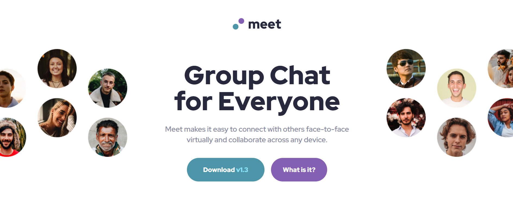
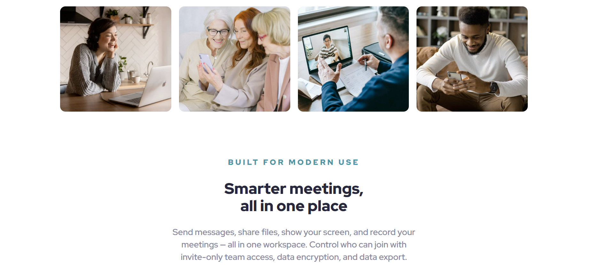
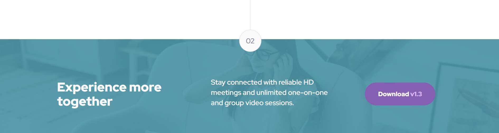

# Frontend Mentor - Meet landing page solution

## Table of contents

- [Overview](#overview)
  - [Screenshot](#screenshot)
  - [Links](#links)
- [My process](#my-process)
  - [Built with](#built-with)
  - [What I learned](#what-i-learned)
  - [Continued development](#continued-development)
- [Acknowledgments](#acknowledgments)

## Overview

This is a solution to the [Meet landing page challenge on Frontend Mentor](https://www.frontendmentor.io/challenges/meet-landing-page-rbTDS6OUR).

### Screenshot

### Links

- Solution URL: [Solution URL here](https://github.com/NunuAbuashvili/Meet-Landing-Page.git)
- Live Site URL: [Live site URL here](https://nunuabuashvili.github.io/Meet-Landing-Page/)

## My process

### Built with

- Semantic HTML5 markup
- CSS custom properties
- Flexbox
- CSS Grid
- Mobile-first workflow

### What I learned

This was an excellent project to practice building responsive web pages for different screen sizes. I think I am slowly moving forward to writing cleaner codes and forming my own style of coding. While working through this project the main focus was on using CSS grid settings effectively.

### Continued development

I would like to focus more on writing a clean code in future projects. There are multiple ways that lead to the same output, and I am planning to research each of them, in order to compare their advantages and weak points.

## Acknowledgments

I would like to thank Bitcamp 101 (Georgia) for offering amazing lectures, and also, my mentor Paata Gharibashvili who has helped me a lot while working on different projects.
